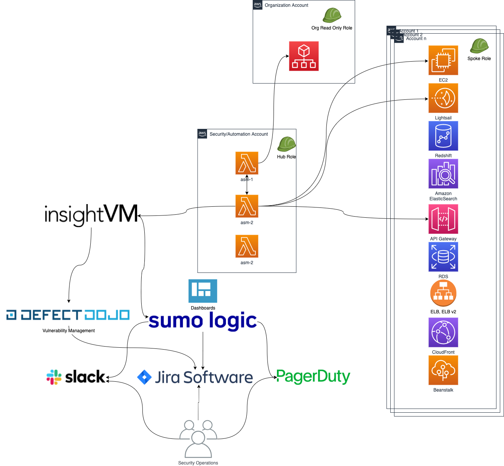

## Advanced Architectures
* This setup could be extended to work with industry leading vulnerability management tools such as Rapid7 InsightVM or Qualys, instead of using Nmap for scanning.
* The results could be fed into a SIEM such as Sumologic for further analysis and dashboarding capabilities and further more invoke Security Operations playbooks and detection notifications from Sumo with its integration with Slack and PagerDuty.

