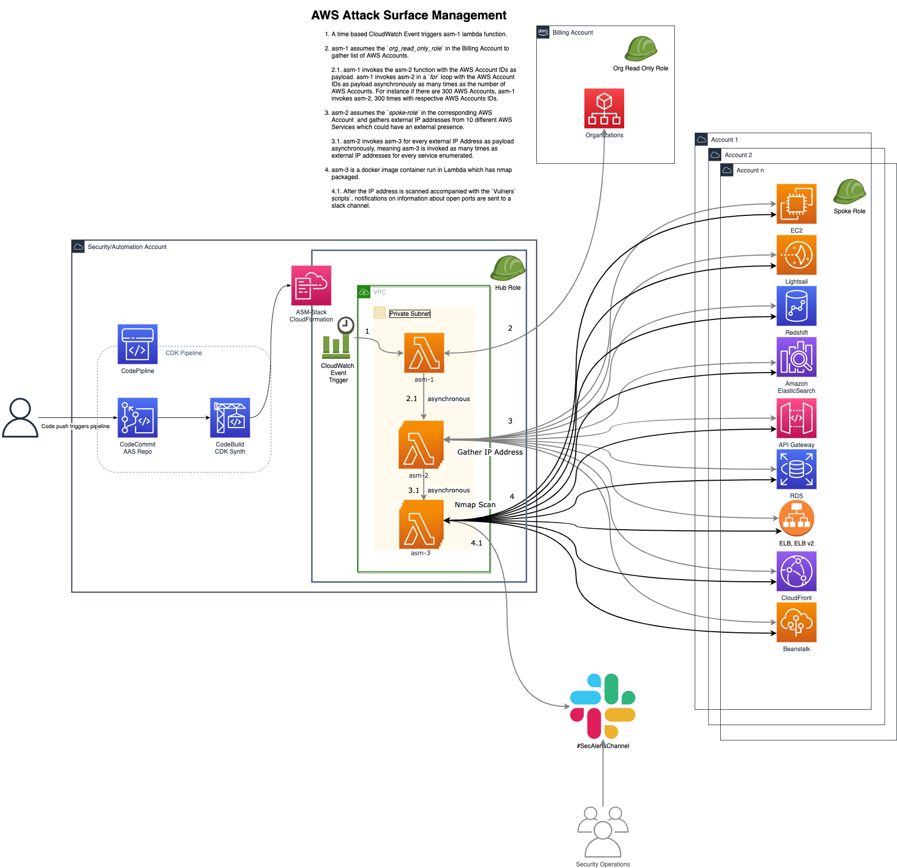

# AWS Attack Surface Management
Continuous AWS Attack Surface Discovery of external facing services and Scanning using Nmap & Vulners' scripts. If you look at this in the right angle :stuck_out_tongue:, technically this is an External Vulnerability Analysis at scale in a tight budget.

## Pre-requsites
* Depends on the presense of an IAM Role structure such as defined by [Fleet Access](https://github.com/raajheshkannaa/fleet-access), where in we have a central automation account with a role with trust relationship with a role in every AWS Account.
* If you use your own IAM Role structure in a multi-account strategy, please ensure to update the necessary code where `src role` is used for the Lambda functions.

## Infrastructure
The infrastructure for this project is built with Cloud Development Kit or CDK. The primary reason is the self mutating capability of CDK Pipelines, secondary because the source for AAS Management is built with Python, building Infrastructure in the same language is a huge plus. If you don't have CDK setup locally already before deployment, please refer to the [Official CDK page](https://github.com/aws/aws-cdk) or install by running below command in a terminal.
> npm i -g aws-cdk 

### Components
* CodeCommit repository `AttackSurfaceManagement` is created part of the pipeline.
* CloudWatch Event - Time Based
    * Cron is scheduled to be triggered midnight UTC
* Lambda Functions - Deployed in a single stage
    * ASM-1 - Gathers AWS Accounts dynamically from AWS Organizations
	* ASM-2 - Uses boto3 to gather external IP address from _Lightsail, RDS, ELBv1/2, Elasticsearch, Redshift, CloudFront, EC2, Beanstalk, API Gateway_
	* ASM-3(Docker Container) - Image built with nmap to scan the external IP Address from those services.
* Roles
    * The entire project is built over existing Trust Relationship of roles in the respective AWS Accounts. Refer Project `FleetAccess` for more information.
	* Hub Role - present in the Security or Automation Account
	* Org Read Only Role - present in the Billing/AWS Organizations Account with a trust relationship with the Hub Role
	* Spoke Role - present in all AWS Accounts or commonly referred as the fleet, with trust relationthip with the Hub Role.
* VPC
    * Lambda functions are built in a VPC with a private and public subnet.
	* NAT Gateway in the public subnet.
	* Lambda functions in the private subnet routing egress traffic through the NAT Gateway. There are no security groups for ingress, as traffic is not expected.

## Usage
> git clone https://github.com/raajheshkannaa/attack-surface-management
* Open config.py and update `AUTOMATION_ACCOUNT` and `HOOK_URL`.
* Automation account is the central account where the `Hub` IAM role with trust relationships' with rest of the fleet accounts using `Spoke` IAM role is already established. 
**Note**: if you are using your own IAM role setup, please update the pipeline stack accordingly.
* HOOK_URL is the slack hook url of the channel to which messages will be post.
* Once updated, run `cdk ls`, this should list the stacks which will deployed. In our case it's the pipeline stack.
* Assuming, automation account credentials are setup in a terminal using `export AWS_PROFILE=aws-automation-creds`, deploy the stack using `cdk deploy`.
* This will deploy the pipeline stack and run for the first time, which will fail since we haven't pushed the code yet.
* The pipeline would have created the CodeCommit repository. After acquiring the repo details, git push cdk app to the repository.
* This will trigger the pipeline and deploy the `LambdaDeploymentStack` which consits for the Event trigger, VPC, Subnets, Lambda functions.
* Once the infrastructure is setup, Attack Surface Discovery is inititated at midnight UTC, which will gather information from all accounts' which has the `Spoke` role deployed and notify of open ports other than port {80,443} in the slack channel mentioned.

## Workflow
* A time based CloudWatch Event triggers **ASM-1** lambda function which assumes the _org_read_only_role_ in the Billing Account to gather list of AWS Accounts and invokes the **ASM-2**.
    * ASM-1 invokes ASM-2 in a _for_ loop passing the AWS Account IDs as the payload, essentially making it a asynchronuous invocation of the ASM-2, the n number of times the number of AWS Accounts.
	* For instance if there are 300 AWS Accounts, ASM-1 invokes ASM-2, 300 times with respective AWS Accounts IDs.
* ASM-2 does the heavy lifting of enumerating 10 different AWS Services which could have an external presense.
    * ASM-2 invokes ASM-3 for every external IP Address in every service as payload. 
* ASM-3 is a docker container run in Lambda which has nmap packaged. This is again is asynchronously invoked, meaning ASM-3 is invoked as many times as the number of external IP Addresses for each service. This is extremely scalable with any number of AWS Accounts and external facing services. After the IP address is scanned with the `Vulners` scripts`, notifications on information about open ports are sent to a slack channel.

## To be Added _(in the next version)_
* Add capability to store nmap scan results to a S3 bucket, for nmap diffs, so that only changes are reported or notified.
* This could then be imported into [DefectDojo](https://github.com/DefectDojo/django-DefectDojo) for a complete Vulnerability Management solution. For more ideas see `Advanced` section.
* Add capability to store IP Addresses and open ports information in a DynamoDB Table, so that this informaiton is looked up before notifications, this way same alerts are not sent again. -- Done

## Why not
* Some of the questions I think of, why not just use AWS Inspector's Network Reachability module to help in identifying the open ports. 
The answer is that, it only helps in the case of EC2 instances, the same couldn't be used for public RDS instances or Elasticsearch instances.
* Follow up question to that answer is, why not just alert on those specific API calls when, say a RDS or Elasticsearc instance is made public. 
The answer is not simple, because for one reason, it's cumbersome to find existing public resources, while also some of the API calls are a bit complicated when it comes to identifying if a resource is being made public.